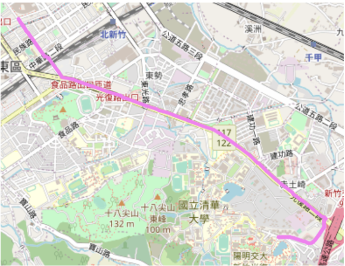
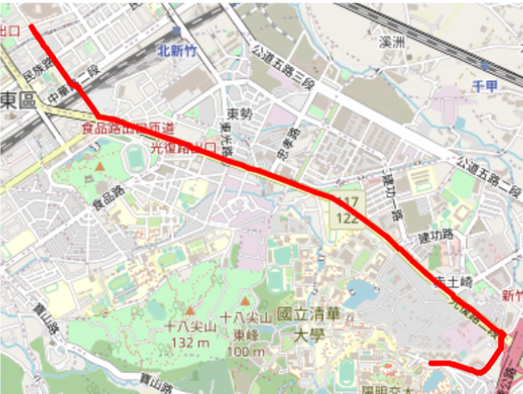

# NYCU-CS-Introduction-of-Artifical-Intelligence
本次專案為交大資工所大三必修-人工智慧導論，共有四份專案內容，分別為：路線最佳化、四子棋、CNN和DT比較、Multi-Armed Bandit

## Author：國立陽明交通大學 資訊管理與財務金融學系財務金融所碩一 313707043 翁智宏

This repository contains all assignments completed for the "Introduction to Artificial Intelligence" course (Spring 2025), including implementations for search algorithms, adversarial game agents, supervised learning models, and reinforcement learning experiments.

## 📁 Homework Overview

| Homework | Title | Topic | Due Date |
|---------|-------|-------|----------|
| HW1 | Route Finding | Search Algorithms (BFS, DFS, UCS, A*) | 2024/03/21 |
| HW2 | Connect Four AI | Minimax, Alpha-Beta, Custom Heuristic Agent | 2025/04/04 |
| HW3 | Supervised Learning | CNN + Decision Tree Image Classifier | 2025/04/21 |
| HW4 | Multi-Armed Bandit | Reinforcement Learning (ε-greedy, Non-stationary env) | 2025/05/13 |

---

## 🧭 HW1: Route Finding with Search Algorithms

Implement various search algorithms to find paths in real-world map data (Hsinchu City) from OpenStreetMap.

### 🔧 Features
- BFS / DFS / UCS / A* search implementations.
- Interactive visualization with `main.ipynb` (folium + Jupyter).
- Heuristic values provided in `heuristic_values.csv`.

### ✅ Evaluation
- BFS: 10%
- DFS: 10%
- UCS: 20%
- A*: 20%
- Testing (10 scenarios): scaled scoring
- Demo session: 40%

###🚗 圖探索演算法比較（Graph Search Algorithm Comparison）
本專案展示五種常見的圖搜尋演算法（UCS、A*、BFS、DFS recursive、DFS stack）在「新竹市」實際地圖上的路徑搜尋結果。每張圖呈現不同演算法的探索方式與行走路徑。

1. UCS - Uniform Cost Search（均一成本搜尋）

核心概念：總是擴展「目前花費成本最小」的節點。

適合：邊權（edge cost）不同的圖。

資料結構：Priority Queue（優先佇列，依照累積成本排序）

特點：
- 可找到 成本最低 的路徑。
- 探索區域與實際距離密切相關。

2. A* Search（A星搜尋）

核心概念：f(n) = g(n) + h(n)，其中：

g(n) 是目前的實際成本（cost so far），

h(n) 是從當前節點到目標的預估成本（heuristic）。

適合：需快速找到最短路徑的情況。

資料結構：Priority Queue，依據 f(n) 排序。

特點：

- 結合貪婪與成本導向，通常比 UCS 更快。
- h(n) 越準確效果越好。

---

## 🎮 HW2: Connect Four Adversarial AI

Develop intelligent agents for the Connect Four game using adversarial search techniques.

### 🔧 Features
- Minimax Agent (Depth-4)
- Alpha-Beta Pruning Agent
- StrongAgent with custom heuristic function
- GUI-based game and CLI batch simulation

### ✅ Evaluation
- Minimax: 10%
- Alpha-Beta: 10%
- Strong Agent + Heuristic: 10%
- Report: 30%
- Demo session: 40%

---

## 🖼️ HW3: CNN and Decision Tree for Image Classification

Train a CNN for animal image classification and apply Decision Tree using extracted features.

### 🔧 Features
- Custom CNN (≤ 3 conv layers) using PyTorch
- Decision Tree using information gain
- Visualization: `loss.png`
- Kaggle submission for model evaluation

### ✅ Evaluation
- CNN model: 25%
- Decision Tree: 30%
- Plot & Experiments: 10%
- Kaggle Score (CNN + DT): 40%
  - CNN > 80% acc for full score
  - DT > 75% acc for full score

---

## 🎰 HW4: Multi-Armed Bandit Reinforcement Learning

Implement agents to solve the k-armed bandit problem under both stationary and non-stationary environments.

### 🔧 Features
- Environment class: Gaussian reward for each arm
- ε-Greedy agent with sample-average or constant step-size
- Experiments: reward trends, optimal action percentage
- Matplotlib for plotting results

### ✅ Evaluation
- Implementation: 15%
- Experiments & Analysis: 45%
- Report quality: 5%
- Quiz: 40%

---

## 📌 Notes
- Do not use non-standard libraries unless explicitly permitted.
- All reports must be written in **English** and saved as `report.pdf`.
- Submission must follow the required folder and file structure, or penalties will apply.

## 🧠 Academic Integrity
Plagiarism or unauthorized code sharing will result in **zero credit** for the assignment.

## 📞 Q&A
For assignment-specific questions, visit the course's Notion or E3 platform.

